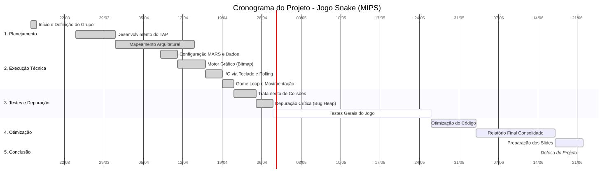

# 🐍 Jogo Snake em Assembly MIPS

[-yellow.svg)]()

## 🚧 Status Atual: Em Desenvolvimento Contínuo (WIP)
O projeto superou com sucesso a fase de validação do núcleo principal da arquitetura. Garantimos um protótipo base 100% funcional e estável, focado na aplicação direta do modelo clássico de Von Neumann e na manipulação de hardware em baixo nível. 

Atualmente, o repositório encontra-se em **desenvolvimento contínuo**, com a equipe focada em aprimorar a arquitetura e adicionar novas integrações com os periféricos do simulador.

### 🚀 Roadmap: Próximos Passos
- [ ] **Placar via Hardware:** Implementação de pontuação em tempo real utilizando MMIO para enviar sinais diretos aos displays de 7 segmentos.
- [ ] **Áudio Nativo Assíncrono:** Integração de chamadas de sistema (Syscall 31) para gerar efeitos sonoros MIDI sem interromper os ciclos da UCP.
- [ ] **Micro-otimizações:** Refatoração contínua de cálculos lógicos na ULA para poupar ciclos de clock.

---

## 📌 Sobre o Projeto
Este projeto consiste no desenvolvimento do clássico jogo "Snake" (Jogo da Cobrinha) escrito inteiramente em linguagem de máquina (Assembly) para a arquitetura MIPS. O desenvolvimento faz parte das atividades da disciplina de **Arquitetura de Computadores (2026.1)** da **Universidade Federal do Maranhão (UFMA)**.

O objetivo principal é aplicar, na prática, os conceitos fundamentais da interação entre software e hardware, demonstrando o domínio sobre operações elementares da Unidade Central de Processamento (UCP), manipulação direta de memória e comunicação com dispositivos de Entrada e Saída.

## 🎯 Escopo e Destaques Técnicos (Core Engine)
O núcleo do jogo foi desenvolvido sob rigorosas limitações de baixo nível:
* **Código 100% Assembly MIPS:** Sem uso de abstrações ou linguagens de alto nível (C, Python, Java).
* **Memory-Mapped I/O (MMIO):** Leitura de teclado via técnica de *Polling* assíncrono (`0xFFFF0000`) e controle gráfico via acesso direto à memória.
* **Estrutura de Dados:** Gerenciamento do corpo da cobra utilizando arrays paralelos alocados estaticamente na seção `.data`.
* **Isolamento de Memória (Bug Fix):** O *Bitmap Display* foi alocado de forma isolada na área de *Heap* (`0x10040000`) para evitar a sobrescrita das variáveis de controle do jogo (resolvendo o conflito de *Address out of range*).
* **Otimização de ULA:** Uso de operações lógicas de deslocamento de bits (`sll`) para otimizar o cálculo matemático de endereçamento dos pixels na matriz gráfica.

## 📊 Gestão do Projeto
O desenvolvimento inicial foi guiado por um planejamento rigoroso (TAP), garantindo a entrega do escopo principal de forma antecipada.
* Utilizamos o **Gráfico de Gantt** para o controle do cronograma macro e o **Painel Kanban** para o fluxo ágil de tarefas. 
* A divisão eficiente de funções permitiu à equipe integrar o motor gráfico e o *Game Loop* semanas antes do prazo limite, liberando o cronograma atual para polimento, testes e expansão de *features*.

*A documentação teórica, cronogramas e relatórios acadêmicos encontram-se nos PDFs anexados a este repositório.*

## ⚙️ Como Executar (Configuração do MARS 4.5)
Para rodar o motor principal do jogo, é necessário utilizar o simulador **MARS (MIPS Assembler and Runtime Simulator) versão 4.5**.

1. Abra o arquivo `snake.asm` no MARS 4.5.
2. Acesse o menu **Tools** e abra as seguintes ferramentas:
   * **Bitmap Display**
   * **Keyboard and Display MMIO Simulator**
3. Configure o **Bitmap Display** estritamente com os seguintes parâmetros:
   * Unit Width in Pixels: `8`
   * Unit Height in Pixels: `8`
   * Display Width in Pixels: `256`
   * Display Height in Pixels: `256`
   * Base address for display: `0x10040000 (heap)` 
4. Conecte ambas as ferramentas clicando no botão **Connect to MIPS**.
5. Compile o código pressionando `F3`.
6. Execute o código pressionando `F5`.
7. **Controles:** Clique dentro da caixa de texto branca inferior do *Keyboard Simulator* e utilize as teclas `W`, `A`, `S` e `D` para movimentar a cobra.

## 🤖 Metodologia: Apoio de Inteligência Artificial
Com o intuito de maximizar o aprendizado e adotar práticas modernas de engenharia de software, a equipe utilizou ferramentas de Inteligência Artificial Generativa (LLMs) como apoio metodológico auxiliar. O uso restringiu-se ao esclarecimento de conceitos arquiteturais de baixo nível, suporte no diagnóstico de conflitos de endereçamento de memória e revisão da documentação técnica, preservando a autoria humana em toda a lógica e tomada de decisão do projeto.

## 👥 Equipe Desenvolvedora
* Alana Mayara Silva Monteiro
* Arthur Felipe Mourão de Oliveira
* Cássio Herberth Rodrigues Araújo
* Millena Gomes Andrade de Menezes Braga
* Stefany Costa de Almeida

**Professor Orientador:** Luiz Henrique Neves Rodrigues

